# UI Component & Styling Catalog

A living inventory of this app's shared, reused-across-pages components and
CSS patterns, so a future design decision can pick a building block from
here rather than re-deriving or half-copying an existing pattern from
whatever page happens to be open.

Motivated by a real gap (#565): `athlete-mode-row`/`public-logbook-row` on
the account page once used an older single-column shape while
`beta-opt-in-row` had already been migrated to the real two-column shape —
a catalog entry for "the standard settings-row pattern" would have made
that drift obvious at a glance instead of needing to be noticed by
inspection. (That specific drift is already fixed — see the settings-row
entry below — but the catalog exists so the *next* one doesn't slip
through unnoticed the same way.)

**Format:** each entry is a name, a description of when to use it, a
screenshot of the real rendered result (dark and light, side by side in a
small table — plain `` image references, deliberately not GitHub's
`#gh-dark-mode-only`/`#gh-light-mode-only` convention, which renders as a
broken image placeholder in most markdown viewers outside github.com
itself, WebStorm's own preview included), and a real, copy-pasteable code
snippet — the actual classes in use, not an abstracted approximation, so
it's always syntactically correct to start from.

Every screenshot in `docs/ui-component-catalog/` was captured against the
real, currently-compiled `public/logbook/tailwind.css` and the real token
stylesheet `climbing-header.js` injects (not a hand-copied approximation
of either) — see that directory's own generation script for exactly how,
next time these need regenerating after a real visual change.

**Source of truth for the custom component classes below:**
`styles/tailwind.css`'s `@utility` blocks (not the compiled
`public/logbook/tailwind.css` — that's generated build output, never
hand-edited). Regular Tailwind utility classes composed inline are not
cataloged individually here; only the custom, named, reused-across-pages
utilities are.

## `row-card`

**Definition:** `styles/tailwind.css` (`@utility row-card`) — a plain
surface box: `background: var(--color-surface)`, bordered, `var(--radius-app)`
corners, `.75rem 1rem` padding. Deliberately minimal on its own; every real
row is `row-card` plus a layout utility (`flex items-center ...`) describing
how its content is arranged.

**When to use:** any list item on a settings/account-style page that needs
a bordered card container — a nav link, a coming-soon placeholder, or a
setting with its own control.

### Variant: nav-link row

Title text plus a trailing chevron, the whole row a clickable `<a>`.

| Dark | Light |
|---|---|
| 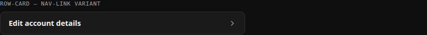 | 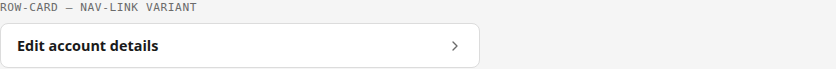 |

```html
<a class="row-card flex items-center justify-between row-card-title hover:border-accent" id="edit-account-link" href="#">
  Edit account details
  <svg class="w-4 h-4 stroke-muted fill-none" viewBox="0 0 24 24" stroke-width="2" stroke-linecap="round" stroke-linejoin="round" aria-hidden="true"><path d="m9 18 6-6-6-6"></path></svg>
</a>
```

(`public/account/index.html`)

### Variant: settings-row (two-column)

Title + description in a text column that grows to fill available space,
a control (switch or button) in a column that sizes to its own content and
never shrinks. This is the standard shape for a labeled, explained setting
— **every** row in the account page's Settings section uses this exact
shape today (the single-column drift that originally motivated this
catalog, `athlete-mode-row`/`public-logbook-row` stacking title/text above
the control instead of beside it, has since been fixed — all three rows
were migrated onto this one shape in #575, specifically because the old
stacked shape caused a real layout bug: a taller control pushed the text
block down, creating dead space the two-column shape doesn't have).

| Dark | Light |
|---|---|
| 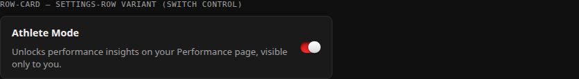 | 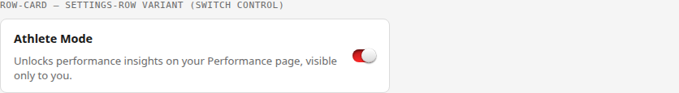 |

```html
<div class="row-card flex items-center gap-3" id="athlete-mode-row">
  <div class="flex-1 min-w-0">
    <span class="row-card-title">Athlete Mode</span>
    <p class="text-[.82rem] text-muted mt-2">Unlocks performance insights on your Performance page, visible only to you.</p>
  </div>
  <button type="button" class="group inline-flex items-center bg-transparent border border-transparent cursor-pointer disabled:opacity-60 disabled:cursor-not-allowed shrink-0" id="athlete-mode-toggle" role="switch" aria-checked="false">
    <span class="switch-track group-aria-checked:switch-track-on"><span class="switch-thumb group-aria-checked:switch-thumb-on"></span></span>
  </button>
</div>
```

A button-triggered variant of the same shape (used when the control is a
real flow/modal, not an instant toggle):

| Dark | Light |
|---|---|
| 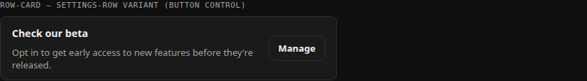 | 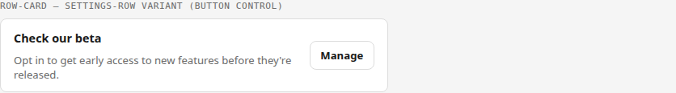 |

```html
<div class="row-card flex items-center gap-3" id="beta-opt-in-row">
  <div class="flex-1 min-w-0">
    <span class="row-card-title">Check our beta</span>
    <p class="text-[.82rem] text-muted mt-2">Opt in to get early access to new features before they're released.</p>
  </div>
  <button type="button" class="btn shrink-0" id="beta-opt-in-manage-btn">Manage</button>
</div>
```

(`public/account/index.html`) — same shape is also built programmatically
by `client/row-card.js` for the Performance hub; keep both in sync if
either changes (see that file's own header comment).

## `btn` / `btn-primary`

**Definition:** `styles/tailwind.css`. `btn` is a plain bordered button
(surface background, border, `var(--radius-app)`, `.82rem` bold text);
`btn-primary` overrides background/border/text to the accent color for
the one primary action in a group. Named `btn`, not `admin-btn` (#459) —
despite the app-wide session gate, this is the app's general button
style, used well outside any admin/owner-only context (the always-
logged-out login form and apex marketing page both use it too).

**When to use:** any action button outside a full modal-form context —
export buttons, a "Manage" trigger, add/sync actions, the login form's
own submit button.

| Dark | Light |
|---|---|
| 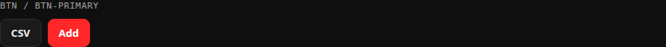 | 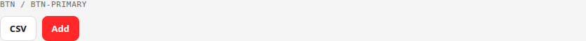 |

```html
<button type="button" class="btn" id="export-csv-btn">CSV</button>
<button type="button" class="btn btn-primary min-w-24 justify-center" id="add-btn">Add</button>
```

(`public/account/index.html`, `public/log/index.html`)

## Switch control (`switch-track` / `switch-thumb`)

**Definition:** `styles/tailwind.css`. A track + thumb pair styled to look
like a native iOS-style toggle, with `switch-track-on`/`switch-thumb-on`
modifier utilities applied via Tailwind's `group-aria-checked:` variant on
the wrapping `<button role="switch">` — deliberately authored as
hand-written `@utility` blocks rather than Tailwind's built-in
`translate-x-*`, since `switch-thumb`'s base transform is one hard-coded
`translateY(-50%)` value that Tailwind's own `--tw-translate-*` variables
would clobber rather than compose with.

**When to use:** any real on/off preference that should apply immediately
on click, no separate save step (Athlete Mode, Public Logbook).

| Dark | Light |
|---|---|
| 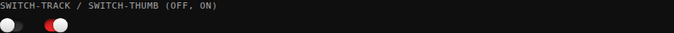 | 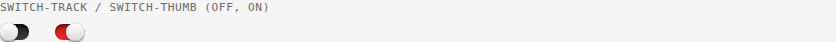 |

```html
<button type="button" class="group inline-flex items-center bg-transparent border border-transparent cursor-pointer disabled:opacity-60 disabled:cursor-not-allowed shrink-0" role="switch" aria-checked="false">
  <span class="switch-track group-aria-checked:switch-track-on"><span class="switch-thumb group-aria-checked:switch-thumb-on"></span></span>
</button>
```

Not for a setting that needs an explanatory modal/consent step first — use
the button-triggered `row-card` variant above instead (see `beta-opt-in-row`).

## `section-heading`

**Definition:** `styles/tailwind.css`. Brand-style heading matching
`<climbing-header>`'s own `<h1>` treatment (`font-display`, uppercase,
letter-spacing), with a baked-in `padding-left: 1rem` that aligns the
heading text with `row-card`'s own inner text below it.

**When to use:** the top-level heading for a grouped section of `row-card`s
("My account", "Settings").

| Dark | Light |
|---|---|
| 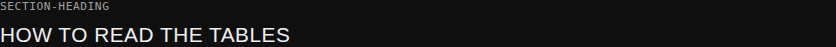 | 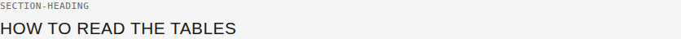 |

```html
<h2 class="section-heading">Settings</h2>
```

## Modal / overlay shape

**Not a named utility class** — a structural convention repeated across
every modal in the app: a fixed, full-viewport, semi-transparent backdrop
(`fixed inset-0 z-[100] bg-[color-mix(in_srgb,black_60%,transparent)]`,
centered flex, `role="dialog" aria-modal="true"`), containing one bordered
card (`bg-background border border-border rounded-app p-5`) with a
title-plus-close-button header row.

| Dark | Light |
|---|---|
| 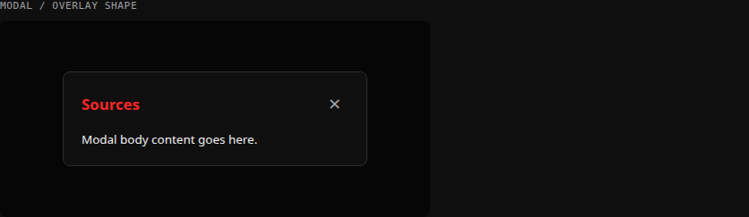 | 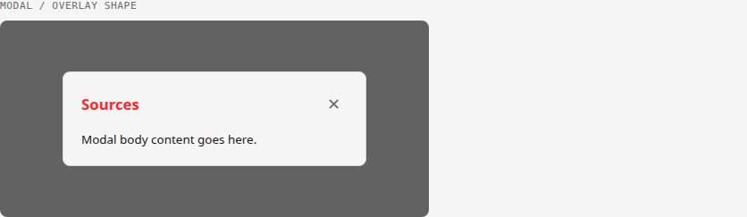 |

```html
<div class="fixed inset-0 z-[100] bg-[color-mix(in_srgb,black_60%,transparent)] flex items-center justify-center px-4 py-6 overflow-y-auto" id="citations-overlay" hidden role="dialog" aria-modal="true" aria-labelledby="citations-title" tabindex="-1">
  <div class="bg-background border border-border rounded-app p-5 w-full max-w-[380px]">
    <div class="flex items-center justify-between mb-[14px]">
      <span class="text-[1.05rem] font-bold text-accent" id="citations-title">Sources</span>
      <button type="button" class="inline-flex items-center justify-center w-8 h-8 border-none bg-transparent text-muted text-[1.1rem] leading-none cursor-pointer hover:text-foreground" id="citations-close" aria-label="Close sources dialog">✕</button>
    </div>
    <!-- modal body -->
  </div>
</div>
```

Every real modal in the app (`citations-overlay`/`evidence-overlay` in
`client/components/climbing-grade-pyramid.js`, `entry-overlay` in
`public/log/index.html`, `notes-overlay` in `client/components/
climbing-entries-table.js`) follows this exact shape. Open/close/focus-trap
behavior is centralized in `client/modal-utils.js`'s `createModalHelpers()`
— never hand-roll that part; only the markup shape is copied per-modal.

## Grade colors & evidence-tier colors

**Grade colors:** `shared/grade-data.js`'s `BOULDER_GRADES`/`LEAD_GRADES`
arrays — each grade entry carries its own CSS custom-property reference
(`{ g: "6A", v: "V3", c: "var(--grade-6a)" }`), not a hardcoded hex value,
so the actual color scale lives in the theme tokens (`public/logbook/
components/climbing-header.js`), not repeated per-grade.

| Dark | Light |
|---|---|
| 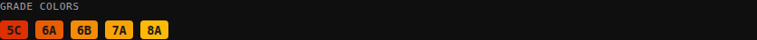 | 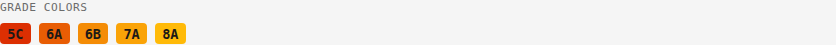 |

**Evidence-tier colors:** three tiers, each with a dark- and light-theme
value (`public/logbook/components/climbing-header.js`):

| Tier | Dark | Light | Meaning |
|---|---|---|---|
| `--tier-peer` | `#5b8def` | `#2e5fb8` | Peer-reviewed research |
| `--tier-heuristic` | `#dba43a` | `#a6740a` | Widely-used coaching heuristic, not (yet) peer-reviewed |
| `--tier-community` | `#cd7cae` | `#a34a7a` | Community/data-analysis source, weakest evidence tier |

| Dark | Light |
|---|---|
| 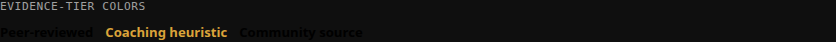 | 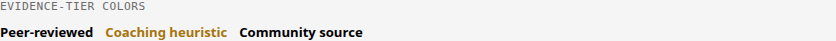 |

An evidence-tier label renders as a small colored, clickable text button
that opens the evidence-tier overlay explaining what the tier means:

```html
<button type="button" class="text-[.82rem] font-bold text-tier-heuristic bg-transparent border-0 p-0 m-0 cursor-pointer hover:brightness-90" data-evidence-tier aria-label="Coaching heuristic -- evidence tier: coaching heuristic, tap to learn more">Coaching heuristic</button>
```

A citation reference renders as a small superscript numbered chip that
opens the citations overlay:

```html
<button type="button" class="align-super ml-[.3em] inline-flex items-center justify-center px-[.35em] py-[.1em] rounded-[.3em] border border-[color-mix(in_srgb,var(--color-accent)_35%,transparent)] text-accent bg-[color-mix(in_srgb,var(--color-accent)_14%,var(--color-surface))] text-[.65rem] font-bold leading-none cursor-pointer hover:brightness-95" data-citation aria-label="View sources">1</button>
```

(`client/components/climbing-grade-pyramid.js` — the only current consumer
of both patterns, since Performance Insights is where evidence-tiering
exists at all.)

## Not yet in this catalog

Deliberately deferred rather than guessed at, since neither was part of
the original motivating gap:

- Filter-panel patterns (`climbing-entries-table.js`'s `toggle-btn`
  checkbox-styled-as-button pattern) — real and reused, but has enough of
  its own variation (icon vs. no-icon, single vs. multi-select) that it
  deserves its own entry written with more care than a quick addition
  here would give it.
- Form-field patterns from `entry-form.js`'s modal (grade picker,
  status toggle, sport-style toggle) — same reasoning as filter-panel
  patterns above.
