# UI Component & Styling Catalog

A living inventory of this app's shared, reused-across-pages components and
CSS patterns, so a future design decision can pick a building block from
here rather than re-deriving or half-copying an existing pattern from
whatever page happens to be open.

Motivated by a real gap (#565): `athlete-mode-row`/`public-logbook-row` on
the account page once used an older single-column shape while
`beta-opt-in-row` had already been migrated to the real two-column shape —
a catalog entry for "the standard settings-row pattern" would have made
that drift obvious at a glance instead of needing to be noticed by
inspection. (That specific drift is already fixed — see the settings-row
entry below — but the catalog exists so the *next* one doesn't slip
through unnoticed the same way.)

**Format:** each entry is a name, a description of when to use it, a
screenshot of the real rendered result (dark and light, side by side in a
small table — plain `` image references, deliberately not GitHub's
`#gh-dark-mode-only`/`#gh-light-mode-only` convention, which renders as a
broken image placeholder in most markdown viewers outside github.com
itself, WebStorm's own preview included), and a real, copy-pasteable code
snippet — the actual classes in use, not an abstracted approximation, so
it's always syntactically correct to start from.

Every screenshot in `docs/ui-component-catalog/` was captured against the
real, currently-compiled `public/-/tailwind.css` and the real token
stylesheet `climbing-header.js` injects (not a hand-copied approximation
of either) — see that directory's own generation script for exactly how,
next time these need regenerating after a real visual change.

**Source of truth for the custom component classes below:**
`styles/tailwind.css`'s `@utility` blocks (not the compiled
`public/-/tailwind.css` — that's generated build output, never
hand-edited). Regular Tailwind utility classes composed inline are not
cataloged individually here; only the custom, named, reused-across-pages
utilities are.

## `error-message`

**Definition:** `styles/tailwind.css`. A tinted, bordered box for a form's
failure state: `.75rem 1rem` padding, `var(--radius-app)` corners, a 12%-red
background mix, a 40%-red border, `.9rem` `var(--color-error)` text. No
margin baked in — add your own (`mt-[.85rem]` inside a modal,
`mb-4` between stacked auth-page fields).

**When to use:** the one shared treatment for "this form failed" —
`client/entry-form.js`'s entry errors, `client/place-picker.js`'s add-place
errors, and the login/register/reset-password pages' own errors. Previously
three copies of the same class string plus a visibly different bare-paragraph
treatment on the auth pages (#894) — pick this over hand-copying the string
again.

| Dark | Light |
|---|---|
| 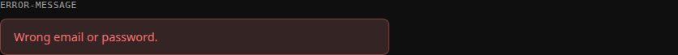 | 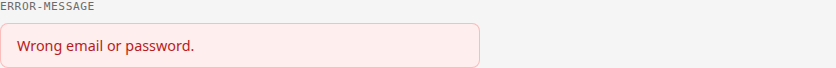 |

```html
<p class="mb-4 error-message" role="alert" aria-live="assertive" tabindex="-1">Wrong email or password.</p>
```

## `row-card`

**Definition:** `styles/tailwind.css` (`@utility row-card`) — a plain
surface box: `background: var(--color-surface)`, bordered, `var(--radius-app)`
corners, `.75rem 1rem` padding. Deliberately minimal on its own; every real
row is `row-card` plus a layout utility (`flex items-center ...`) describing
how its content is arranged.

**When to use:** any list item on a settings/account-style page that needs
a bordered card container — a nav link, a coming-soon placeholder, or a
setting with its own control.

### Variant: nav-link row

Title text plus a trailing chevron, the whole row a clickable `<a>`.

| Dark | Light |
|---|---|
|  |  |

```html
<a class="row-card flex items-center justify-between row-card-title hover:border-accent" id="edit-account-link" href="#">
  Edit account details
  <svg class="w-4 h-4 stroke-muted fill-none" viewBox="0 0 24 24" stroke-width="2" stroke-linecap="round" stroke-linejoin="round" aria-hidden="true"><path d="m9 18 6-6-6-6"></path></svg>
</a>
```

(`public/account/index.html`)

### Variant: settings-row (two-column)

Title + description in a text column that grows to fill available space,
a control (switch or button) in a column that sizes to its own content and
never shrinks. This is the standard shape for a labeled, explained setting
— **every** row in the account page's Settings section uses this exact
shape today (the single-column drift that originally motivated this
catalog, `athlete-mode-row`/`public-logbook-row` stacking title/text above
the control instead of beside it, has since been fixed — all three rows
were migrated onto this one shape in #575, specifically because the old
stacked shape caused a real layout bug: a taller control pushed the text
block down, creating dead space the two-column shape doesn't have).

| Dark | Light |
|---|---|
|  |  |

```html
<div class="row-card flex items-center gap-3" id="athlete-mode-row">
  <div class="flex-1 min-w-0">
    <span class="row-card-title">Athlete Mode</span>
    <p class="text-[.82rem] text-muted mt-2">Unlocks performance insights on your Performance page, visible only to you.</p>
  </div>
  <button type="button" class="group inline-flex items-center bg-transparent border border-transparent cursor-pointer disabled:opacity-60 disabled:cursor-not-allowed shrink-0" id="athlete-mode-toggle" role="switch" aria-checked="false">
    <span class="switch-track group-aria-checked:switch-track-on"><span class="switch-thumb group-aria-checked:switch-thumb-on"></span></span>
  </button>
</div>
```

A button-triggered variant of the same shape (used when the control is a
real flow/modal, not an instant toggle):

| Dark | Light |
|---|---|
|  |  |

```html
<div class="row-card flex items-center gap-3" id="example-row">
  <div class="flex-1 min-w-0">
    <span class="row-card-title">Setting name</span>
    <p class="text-[.82rem] text-muted mt-2">What the setting does.</p>
  </div>
  <button type="button" class="btn shrink-0" id="example-manage-btn">Manage</button>
</div>
```

(The screenshots show the account page's former beta opt-in row. #953
replaced that with a link to its own sub-page, `beta-row`: the same
two-column shape with a chevron in place of the button.)

(`public/account/index.html`) — same shape is also built programmatically
by `client/row-card.js` for the Performance hub; keep both in sync if
either changes (see that file's own header comment).

## `btn` / `btn-primary`

**Definition:** `styles/tailwind.css`. `btn` is a plain bordered button
(surface background, border, `var(--radius-app)`, `.82rem` bold text);
`btn-primary` overrides background/border/text to the accent color for
the one primary action in a group. Named `btn`, not `admin-btn` (#459) —
despite the app-wide session gate, this is the app's general button
style, used well outside any admin/owner-only context (the always-
logged-out login form and apex marketing page both use it too).

**When to use:** any action button outside a full modal-form context —
export buttons, a "Manage" trigger, add/sync actions, the login form's
own submit button.

| Dark | Light |
|---|---|
|  |  |

```html
<button type="button" class="btn" id="export-csv-btn">CSV</button>
<button type="button" class="btn btn-primary min-w-24 justify-center" id="add-btn">Add</button>
```

(`public/account/index.html`, `public/log/index.html`)

## Switch control (`switch-track` / `switch-thumb`)

**Definition:** `styles/tailwind.css`. A track + thumb pair styled to look
like a native iOS-style toggle, with `switch-track-on`/`switch-thumb-on`
modifier utilities applied via Tailwind's `group-aria-checked:` variant on
the wrapping `<button role="switch">` — deliberately authored as
hand-written `@utility` blocks rather than Tailwind's built-in
`translate-x-*`, since `switch-thumb`'s base transform is one hard-coded
`translateY(-50%)` value that Tailwind's own `--tw-translate-*` variables
would clobber rather than compose with.

**When to use:** any real on/off preference that should apply immediately
on click, no separate save step (Athlete Mode, Public Logbook).

| Dark | Light |
|---|---|
|  |  |

```html
<button type="button" class="group inline-flex items-center bg-transparent border border-transparent cursor-pointer disabled:opacity-60 disabled:cursor-not-allowed shrink-0" role="switch" aria-checked="false">
  <span class="switch-track group-aria-checked:switch-track-on"><span class="switch-thumb group-aria-checked:switch-thumb-on"></span></span>
</button>
```

Not for a setting that needs an explanatory modal/consent step first — use
the button-triggered `row-card` variant above, or a sub-page (like the
account page's Beta channel row, #953) instead.

## `page-title` / `section-heading` / `card-section-heading` / `sources-heading`

**Definition:** `styles/tailwind.css`. `section-heading` is the base:
brand-style heading matching `<climbing-header>`'s own `<h1>` treatment
(`font-display`, uppercase, letter-spacing), no indent. `card-section-
heading`, `sources-heading` and `page-title` all derive from it via `@apply`.

**When to use `page-title`:** the title of a whole page -- Performance
Insights report pages, /help pages (via `help-article`'s own `h1` rule).
Same as `section-heading`, bigger (`1.8rem`).

| Dark | Light |
|---|---|
| 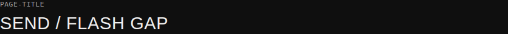 | 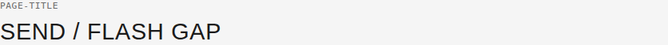 |

```html
<h1 class="page-title">Send / Flash Gap</h1>
```

**When to use `section-heading`:** a section within a page, sitting
directly above its own content, not aligned against a `row-card` list --
sections inside a /help page (via `help-article`'s own `h2` rule).

| Dark | Light |
|---|---|
|  |  |

```html
<h2 class="section-heading">How to read the tables</h2>
```

**When to use `card-section-heading`:** the top-level heading for a
grouped section of `row-card`s ("My account", "Settings") -- adds the
`padding-left: 1rem` that aligns the heading text with `row-card`'s own
inner text below it.

| Dark | Light |
|---|---|
| 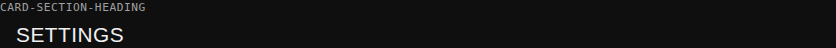 | 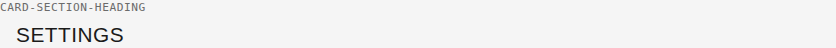 |

```html
<h2 class="card-section-heading">Settings</h2>
```

**When to use `sources-heading`:** a page's "Sources" heading -- adds a
thin hairline border above the heading, so a references/citations
section reads as visually distinct from the content sections above it.
Used by every Performance Insights report page and the Grade scales
help page.

| Dark | Light |
|---|---|
| 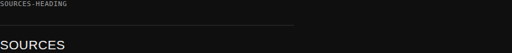 | 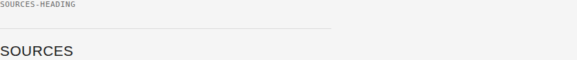 |

```html
<h2 class="sources-heading">Sources</h2>
```

## Modal / overlay shape

**Not a named utility class** — a structural convention repeated across
every modal in the app: a fixed, full-viewport, semi-transparent backdrop
(`fixed inset-0 z-[100] bg-[color-mix(in_srgb,black_60%,transparent)]`,
centered flex, `role="dialog" aria-modal="true"`), containing one bordered
card (`bg-background border border-border rounded-app p-5`) with a
title-plus-close-button header row.

| Dark | Light |
|---|---|
|  |  |

```html
<div class="fixed inset-0 z-[100] bg-[color-mix(in_srgb,black_60%,transparent)] flex items-center justify-center px-4 py-6 overflow-y-auto" id="citations-overlay" hidden role="dialog" aria-modal="true" aria-labelledby="citations-title" tabindex="-1">
  <div class="bg-background border border-border rounded-app p-5 w-full max-w-[380px]">
    <div class="flex items-center justify-between mb-[14px]">
      <span class="text-[1.05rem] font-bold text-accent" id="citations-title">Sources</span>
      <button type="button" class="inline-flex items-center justify-center w-8 h-8 border-none bg-transparent text-muted text-[1.1rem] leading-none cursor-pointer hover:text-foreground" id="citations-close" aria-label="Close sources dialog">✕</button>
    </div>
    <!-- modal body -->
  </div>
</div>
```

Every real modal in the app (`citations-overlay`/`evidence-overlay` in
`client/components/climbing-grade-pyramid.js`, `entry-overlay` in
`public/log/index.html`, `notes-overlay` in `client/components/
climbing-entries-table.js`) follows this exact shape. Open/close/focus-trap
behavior is centralized in `client/modal-utils.js`'s `createModalHelpers()`
— never hand-roll that part; only the markup shape is copied per-modal.

## Grade colors & evidence-tier colors

**Grade colors:** `shared/grade-data.js`'s `gradeColor(grade, type)`
resolves any grade to one of five tier colors via `GRADE_TIER_COLORS`
(`{ beginner: "var(--grade-tier-beginner)", ... }`) — a flat per-tier
mapping, not a per-grade one, so the actual color scale lives entirely in
the theme tokens (`public/-/components/climbing-header.js`'s
`--grade-tier-*` custom properties), never repeated per-grade. Rendered
via the shared `grade-badge` utility class (`styles/tailwind.css`), with
the tier color set as an inline `background` (see `climbing-entries-
table.js`'s own grade-badge markup).

| Dark | Light |
|---|---|
|  |  |

**Evidence-tier colors:** three tiers, each with a dark- and light-theme
value (`public/-/components/climbing-header.js`):

| Tier | Dark | Light | Meaning |
|---|---|---|---|
| `--tier-peer` | `#5b8def` | `#2e5fb8` | Peer-reviewed research |
| `--tier-heuristic` | `#dba43a` | `#a6740a` | Widely-used coaching heuristic, not (yet) peer-reviewed |
| `--tier-community` | `#cd7cae` | `#a34a7a` | Community/data-analysis source, weakest evidence tier |

| Dark | Light |
|---|---|
|  |  |

An evidence-tier label renders as a small colored, clickable text button
that opens the evidence-tier overlay explaining what the tier means:

```html
<button type="button" class="text-[.82rem] font-bold text-tier-heuristic bg-transparent border-0 p-0 m-0 cursor-pointer hover:brightness-90" data-evidence-tier aria-label="Coaching heuristic -- evidence tier: coaching heuristic, tap to learn more">Coaching heuristic</button>
```

A citation reference renders as a small superscript numbered chip that
opens the citations overlay:

```html
<button type="button" class="align-super ml-[.3em] inline-flex items-center justify-center px-[.35em] py-[.1em] rounded-[.3em] border border-[color-mix(in_srgb,var(--color-accent)_35%,transparent)] text-accent bg-[color-mix(in_srgb,var(--color-accent)_14%,var(--color-surface))] text-[.65rem] font-bold leading-none cursor-pointer hover:brightness-95" data-citation aria-label="View sources">1</button>
```

(`client/components/climbing-grade-pyramid.js` — the only current consumer
of both patterns, since Performance Insights is where evidence-tiering
exists at all.)

## List-picker (button + popover)

**Definition:** `client/modal-utils.js`'s `createListPicker`/
`renderOptionList` — a button that opens a `role="listbox"` popover
below it (`top-[calc(100%+.4rem)]`, `rounded-app` border, the same
drop-shadow every popover in the app uses), each row a `role="option"`
with an invisible-until-`aria-selected` checkmark. Built for #703 to
replace a native `<select>` — a native select's own OPEN dropdown panel
is OS/browser-rendered chrome that plain CSS can't restyle to match this
convention, the same reason every other picker in the app (place picker,
discipline picker, header menu) was already built this way rather than
as a real `<select>`.

**When to use:** any single-select field where the option list itself
needs real styling (not just the closed trigger) — a grade value, which
scale is active, anything a native `<select>`'s own chrome would
otherwise leak through on.

| Dark | Light |
|---|---|
| 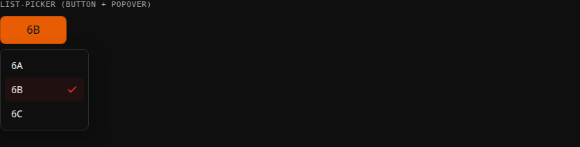 | 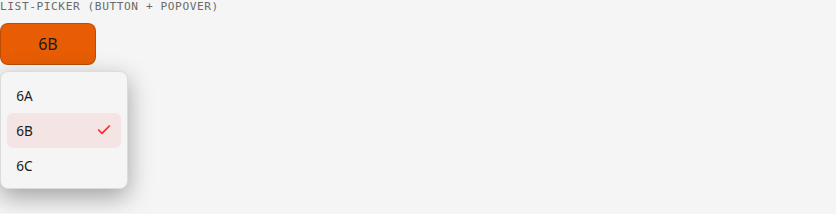 |

```html
<div class="relative" id="grade-value-wrap">
  <button type="button" class="grade-select w-full py-[.65rem]" id="grade-value-btn" aria-haspopup="listbox" aria-expanded="false"></button>
  <div class="absolute top-[calc(100%+.4rem)] left-0 z-20 bg-background border border-border rounded-app p-[.35rem] min-w-full w-max max-w-[calc(100vw-2rem)] shadow-[0_8px_24px_color-mix(in_srgb,black_35%,transparent)]" id="grade-value-popover" role="listbox" aria-label="Grade" hidden>
    <ul class="max-h-[13rem] overflow-y-auto m-0 p-0 list-none" id="grade-value-listbox"></ul>
  </div>
</div>
```

Each `<li>` `renderOptionList` generates:

```html
<li role="option" data-key="6B" aria-selected="true" class="flex items-center justify-between gap-[.5rem] px-[.6rem] py-[.5rem] rounded-[calc(var(--radius-app)-2px)] cursor-pointer text-[.85rem] text-foreground hover:bg-[color-mix(in_srgb,var(--color-accent)_8%,transparent)] [&_svg]:w-4 [&_svg]:h-4 [&_svg]:stroke-accent [&_svg]:fill-none [&_svg]:invisible aria-selected:[&_svg]:visible">
  6B
  <svg viewBox="0 0 24 24" stroke-width="2.5" stroke-linecap="round" stroke-linejoin="round"><path d="M20 6 9 17l-5-5"></path></svg>
</li>
```

Open/close/outside-click/Escape is `client/modal-utils.js`'s
`createDisclosure` (same as the Modal / overlay shape above uses
`createModalHelpers`) — never hand-roll that part. `client/entry-form.js`
(grade value, scale, and the Non-standard number/letter/modifier fields)
and `client/report-grade-scale-picker.js` (#704) are the two real
consumers.

**A form-field trigger is `text-[1rem]` regular weight, matching its
row's other fields** — `.grade-select`'s own `font-size`/`font-weight`
(`styles/tailwind.css`) had drifted to `.85rem`/`700` (carried over
unquestioned from `grade-badge`'s own *display* styling, a different
context) before #703's review pass caught it: Name/Place/Date on the
same row are `1rem` regular, and the smaller font-size was quietly
producing a shorter line-height too, reading as the whole control being
too short even though its padding matched. Worth checking directly
(`getComputedStyle`) against a real sibling field, not assumed, if a
future control in this family looks subtly off.

## Date picker (calendar popover)

**Definition:** `client/calendar-date-picker.js`'s `calendarDatePickerHtml`/
`createCalendarDatePicker` — a real month-grid popover (Prev/Next month
header, a 7-column weekday grid), same button+popover shape as the
list-picker above. Built for #703's review pass, originally inline in
`client/entry-form.js`, to replace a native `<input type="date">` +
`.showPicker()` call — that native picker's own open panel is OS/browser
chrome for the identical reason a native `<select>`'s dropdown is —
unstylable, so it never matched this app's own popover convention.
Extracted into this shared component in #736 once `client/time-window.js`'s
Custom range turned out to need the exact same fix, not a second
hand-rolled copy — `entry-form.js`'s own date field and `time-window.js`'s
Custom range start/end are its three real instances today, each with its
own `idPrefix` so their ids don't collide.

**When to use:** any full-date (`YYYY-MM-DD`) selection. It can't
represent a partial date (`YYYY-MM`, no day) — `client/entry-form.js`'s
own date field keeps its free-text input alongside this button for
exactly that case; the picker only ever writes a complete date.

| Dark | Light |
|---|---|
| 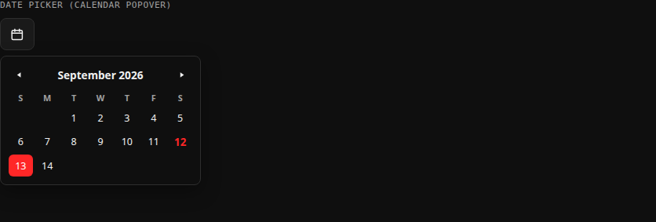 | 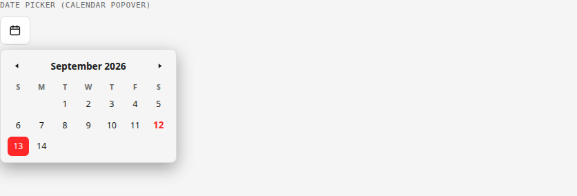 |

```html
<div class="relative flex-[0_0_2.75rem]" id="date-picker-wrap">
  <button type="button" class="w-full h-full flex items-center justify-center border border-border rounded-app bg-surface text-foreground cursor-pointer hover:border-accent" id="date-picker-btn" aria-haspopup="dialog" aria-expanded="false" aria-label="Pick a date">
    <svg class="w-[1.1rem] h-[1.1rem] stroke-current" viewBox="0 0 24 24" fill="none" stroke-width="2" stroke-linecap="round" stroke-linejoin="round">
      <rect x="3" y="5" width="18" height="16" rx="2"></rect>
      <line x1="3" y1="10" x2="21" y2="10"></line>
      <line x1="8" y1="3" x2="8" y2="7"></line>
      <line x1="16" y1="3" x2="16" y2="7"></line>
    </svg>
  </button>
  <div class="absolute top-[calc(100%+.4rem)] right-0 z-20 bg-background border border-border rounded-app p-[.6rem] w-[16rem] max-w-[calc(100vw-2rem)] shadow-[0_8px_24px_color-mix(in_srgb,black_35%,transparent)]" id="date-picker-popover" role="dialog" aria-label="Pick a date" hidden>
    <!-- Prev/Next month header + weekday row -- see calendar-date-picker.js's own render() -->
    <div class="grid grid-cols-7 gap-[.15rem]" id="date-picker-grid"></div>
  </div>
</div>
```

Each day cell:

```html
<button type="button" class="h-7 flex items-center justify-center rounded-[calc(var(--radius-app)-2px)] text-[.78rem] text-foreground border-0 bg-transparent cursor-pointer hover:bg-[color-mix(in_srgb,var(--color-accent)_8%,transparent)] aria-selected:bg-accent aria-selected:text-accent-foreground aria-selected:hover:bg-accent aria-[current=date]:font-bold aria-[current=date]:text-accent" data-date="2026-09-13" aria-selected="true" aria-current="false">13</button>
```

The displayed month is its own state, independent of the field's actual
value — Prev/Next is browsing, not selecting. It only re-syncs to
whatever the field currently holds each time the popover opens, same
"render on open" convention `createListPicker` above already uses.

## `help-article` (typography)

**Definition:** `styles/tailwind.css` — heading/paragraph sizing and
spacing for long-form prose (h1/h2/p), applied to the wrapping element
around real body content. Plain `font-sans`, not `section-heading`'s
`font-display`/uppercase/tracking-wide treatment — that's a short
section *label* style matching `<climbing-header>`'s own brand `<h1>`
(see `section-heading` above), not a fit for a real page heading
followed by several paragraphs of explanation.

**When to use:** any page rendering genuine long-form prose content —
currently the `/help` section (#876/#878), the first place in this app
that needed one at all; everywhere else is UI chrome or short labels
with their own existing treatment.

| Dark | Light |
|---|---|
| 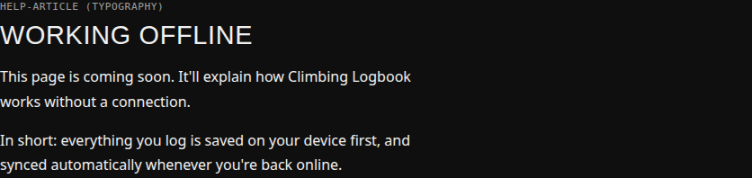 | 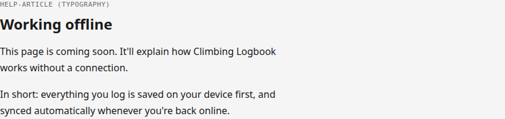 |

```html
<article class="help-article">
  <h1>Working offline</h1>
  <p>This page is coming soon. It'll explain how Climbing Logbook works without a connection.</p>
</article>
```

(`views/_includes/help-layout.njk` — content itself is authored in plain
Markdown, per that section's own `.eleventy.js` config; the raw
`<h1>`/`<p>` tags Markdown produces carry no classes of their own, so
this utility styles them by element selector within its own scope,
not via per-tag classes on content authors would otherwise need to add.)

## Not yet in this catalog

Deliberately deferred rather than guessed at, since neither was part of
the original motivating gap:

- Filter-panel patterns (`climbing-entries-table.js`'s `toggle-btn`
  checkbox-styled-as-button pattern) — real and reused, but has enough of
  its own variation (icon vs. no-icon, single vs. multi-select) that it
  deserves its own entry written with more care than a quick addition
  here would give it.
- Status/sport-style toggle groups from `entry-form.js`'s modal — same
  reasoning as filter-panel patterns above (the grade/date pickers that
  used to sit in this same bucket now have their own entries, above).
